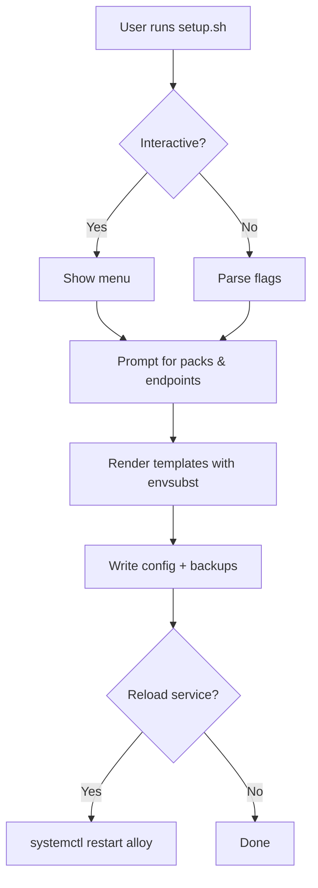

# Grafana Alloy Bootstrap


> **TL;DR** – One‑command installer that spins up Grafana Alloy with a modular set of metrics & log collectors on Debian/Ubuntu.

---

## 📦 Features
- 🚀 **One‑click setup** – run the script and you’re ready to collect host metrics, Docker stats, logs, etc.
- 🔁 **Idempotent** – safe to re‑run; only changes when needed.
- 🎛️ **Interactive & silent modes** – menu driven or fully scripted via flags.
- 📦 **Modular packs** – enable exactly what you need (host metrics, Docker, logs…).
- 💾 **Automatic backups** – timestamped copies of `/etc/alloy/config.alloy` before every change.
- ✅ **CI tested** – ShellCheck validation on every PR.

---

## Quick Start
```bash
# One‑liner (clone → make executable → run as root)
git clone https://github.com/Unknowlars/Grafana-alloy-bootstrap.git && \
  cd Grafana-alloy-bootstrap && chmod +x alloy-bootstrap/setup.sh && \
  sudo ./alloy-bootstrap/setup.sh
```
The script will:
1. Install Grafana Alloy via the official APT repo.
2. Show a menu of available packs.
3. Prompt for Prometheus/Loki endpoints.
4. Generate `/etc/alloy/config.alloy` and related files.
5. Enable & start the `alloy.service`.

---

## 📚 Requirements
- **OS**: Debian‑based (Debian 11+, Ubuntu 20.04+, Raspberry Pi OS)
- **Permissions**: Root (`sudo` required)
- **Network**: Outbound access to your Prometheus/VictoriaMetrics & Loki endpoints.

---

## ⚙️ Usage Modes
### Interactive Mode (default)
```bash
sudo ./alloy-bootstrap/setup.sh
```
A menu lets you pick packs, configure endpoints, and enable the Alloy UI.

### Silent Mode (automation)
Ideal for Docker, Ansible, Terraform, or cloud‑init:
```bash
sudo ./alloy-bootstrap/setup.sh \
  --non-interactive \
  --packs host-metrics,host-logs,docker \
  --prom-base-url http://192.168.0.123:9090 \
  --loki-base-url http://192.168.0.123:3400 \
  --ui-listen-addr 127.0.0.1:12345
```
---

## 📦 Available Packs
| # | Pack | ID | Signals | ⛑️ | Description |
|---|------|-----|---------|-----|-------------|
| 1 | Host metrics | `host-metrics` | metrics | :chart_with_upwards_trend: | node_exporter for CPU, memory, disk, network |
| 2 | Host logs | `host-logs` | logs | :file_folder: | journald, syslog, /var/log collection |
| 3 | Docker | `docker` | metrics,logs | :whale: | cAdvisor + Docker container logs |
| 4 | Logporter | `logporter` | metrics | :package: | Custom Prometheus scrape target |
| 5 | PostgreSQL | `postgres` | metrics | :rocket: | postgres_exporter scrape |
| 6 | Traefik metrics | `traefik-metrics` | metrics | :traffic_light: | Traefik integrations |
| 7 | Traefik access logs | `traefik-access-logs-geoip` | logs | :world_map: | Access logs with GeoIP country labels |
| 8 | Software inventory | `software-inventory` | metrics | :computer: | Linux packages, updates, system info |
| 9 | Live debugging | `livedebugging` | none | :bug: | Alloy UI debug stream |

**Signal Types**
- `metrics`: Requires Prometheus/VictoriaMetrics endpoint.
- `logs`: Requires Loki endpoint.
- `metrics,logs`: Requires both endpoints.
- `none`: No external endpoint required.

---

## 🛠️ Command‑Line Options
| Option | Description |
|--------|-------------|
| `--debug` | Enable shell trace (`set -x`). |
| `--no-install` | Skip Alloy APT install/upgrade checks. |
| `-h, --help` | Show help message. |
| `--non-interactive` | Run without prompts. |
| `--yes` | Auto‑answer "yes" to prompts. |
| `--packs <ids>` | Comma‑separated pack IDs. |
| `--prom-base-url <url>` | Prometheus/VictoriaMetrics base URL. |
| `--loki-base-url <url>` | Loki base URL. |
| `--ui-listen-addr <addr>` | Enable Alloy UI (e.g., `127.0.0.1:12345`). |
| `--no-ui` | Force‑disable Alloy UI. |
| `--var NAME=value` | Pack‑specific variable (repeatable). |

### Environment Variables
| Variable | Description | Default |
|----------|-------------|---------|
| `STABILITY_LEVEL` | Alloy stability track | `generally-available` |
| `COMMUNITY_COMPONENTS` | Enable community components | `false` |

---

## 🔧 What It Changes
1. **Configuration** – `/etc/alloy/config.alloy`, `/etc/default/alloy` (with timestamped backups). 2. **State** – `/var/lib/alloy-bootstrap/state.env`. 3. **Service** – Enables & starts `alloy.service`; reloads/restarts as needed. 4. **Permissions** – Adds `alloy` user to required groups (`docker`, `systemd-journal`, etc.).

---

## 🔄 How It Works (Mermaid)

Packs are discovered from `templates/packs/*/pack.conf` and rendered using `envsubst`. Each pack provides a modular snippet that can be independently enabled or disabled.

---

## 📜 Troubleshooting
- **Check Alloy status**
```bash
systemctl status alloy
journalctl -u alloy -n 100 --no-pager
```
- **Validate configuration**
```bash
alloy validate /etc/alloy/config.alloy
alloy fmt --check /etc/alloy/config.alloy
```
- **Debug mode**
```bash
sudo ./alloy-bootstrap/setup.sh --debug
```
- **Rollback** – Backups are created automatically:
```bash
ls -la /etc/alloy/config.alloy.bak.*
sudo cp /etc/alloy/config.alloy.bak.20251220-224151 /etc/alloy/config.alloy
sudo systemctl restart alloy
```
- **Reset state**
```bash
sudo rm -f /var/lib/alloy-bootstrap/state.env
```

---

## 🤝 Contributing
Contributions are welcome! See [CONTRIBUTING.md](CONTRIBUTING.md) for:
- Development setup
- Adding new packs
- Coding standards (see [AGENTS.md](AGENTS.md))
- Pull request process

---

## 🔐 Security
See [SECURITY.md](SECURITY.md) for our security policy and how to report vulnerabilities.

---

## 📜 License
Released under the [MIT License](LICENSE).

---

## 📚 Resources
- [Grafana Alloy Documentation](https://grafana.com/docs/alloy/)
- [ShellCheck](https://www.shellcheck.net/) – Bash linting
- [Alloy Configuration Reference](https://grafana.com/docs/alloy/reference/configuration/)
